# Network Topology: Distributed VPN Infrastructure

## Architecture Overview
The infrastructure follows a **Shared-Nothing Architecture**. Each node operates independently to ensure maximum fault tolerance. There is no central point of failure (SPOF); user traffic is manually balanced across available nodes.

### Visual Diagram

```mermaid
graph TD
    User((Client Devices))
    
    subgraph "Production Environment (High Availability)"
        NL[🇳🇱 NL-AMS: Primary Node]
        AT[🇦🇹 AT-VIE: Failover Node]
        RU[🇷🇺 RU-MOW: Transit/Entry]
    end
    
    subgraph "Staging Environment"
        DE[🇩🇪 DE-DUS: Experimental]
    end
    
    Internet((Global Internet))

    %% Connections
    User -->|VLESS/XTLS| NL
    User -->|VLESS/Shadowsocks| AT
    User -->|VLESS Reality| RU
    User -->|Proto-Test| DE
    
    NL --> Internet
    AT --> Internet
    RU --> Internet
    DE --> Internet

    %% Styling
    style NL fill:#d4f1f9,stroke:#333,stroke-width:2px
    style AT fill:#fff3cd,stroke:#333,stroke-width:2px
    style RU fill:#f8d7da,stroke:#333,stroke-width:2px
```

## Node Specifications

| Node ID    | Role             | Location       | Stack                                  | Connectivity                    |
|:-----------|:-----------------|:---------------|:---------------------------------------|:--------------------------------|
| **NL-AMS** | **Primary Exit** | Amsterdam, NL  | Ubuntu 22.04 + Docker (Outline, 3x-ui) | 1 Gbps / Low Latency to EU      |
| **AT-VIE** | **Failover**     | Vienna, AT     | Ubuntu 22.04 + 3x-ui                   | Backup route if NL is blocked   |
| **RU-MOW** | **Transit**      | Moscow, RU     | Ubuntu 20.04 + 3x-ui (Reality)         | Entry point for deep censorship |
| **DE-DUS** | **Staging**      | Dusseldorf, DE | Ubuntu 24.04 + Remnawave               | Sandbox for testing protocols   |

## Management Plane
* **Access:** SSH Password authentication (MVP state). Migration to Key-based auth is planned.
* **Configuration:** Infrastructure as Code (Local Git repository).
* **Monitoring:** Passive (Script-based periodic checks).

